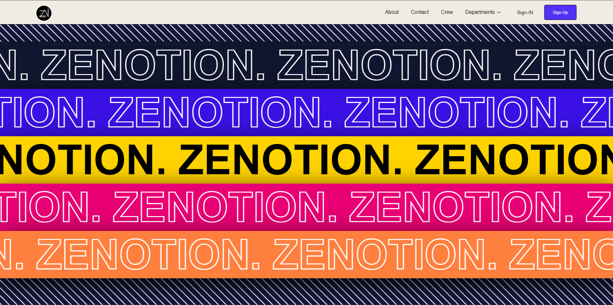

# zenotion

This website facilitates the sharing of educational resources between teachers and students. It includes personal spaces for students to store and manage their resources. Through this project, I gained valuable experience in both front-end and back-end development.

             

